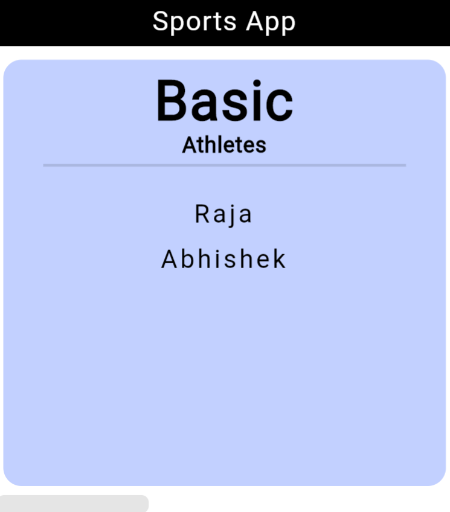
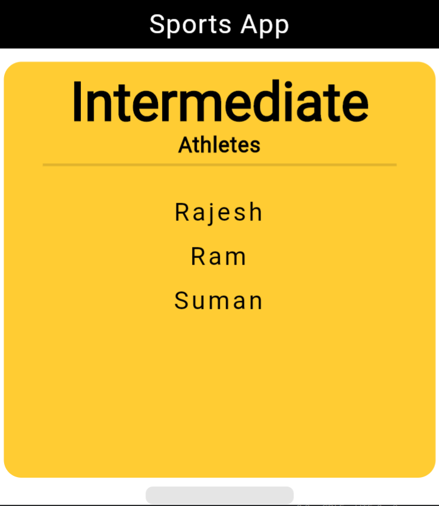
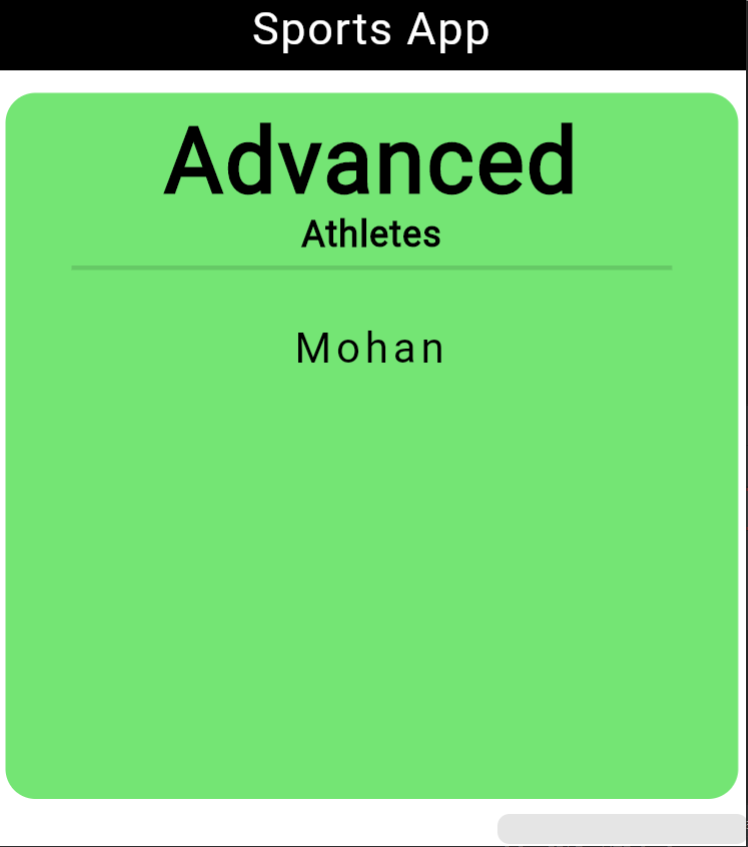

# Athletes View App

The Athletes View App is a mobile application that allows users to view basic, intermediate, and advanced athletes. The app provides a simple interface for users to browse through athletes' profiles and gain insights into their achievements and skills.








## Features

- **Athlete Categories**: Explore basic, intermediate, and advanced athletes.
- **Athlete Profiles**: View detailed profiles of athletes, including their names and information.
- **User-Friendly Interface**: Easy-to-use interface for seamless navigation and browsing.

## Technologies Used

The Athletes View App is built using the following technologies:

- Flutter: A cross-platform framework for building native mobile apps.
- Dart: The programming language used for developing the app.

## Installation

To run the Athletes View App locally on your device, follow these steps:

1. Ensure that you have Flutter installed. Refer to the official Flutter documentation for installation instructions.

2. Clone this repository to your local machine.

3. Navigate to the project directory.

4. Install the required dependencies by running the following command:

   ```bash
   flutter pub get
